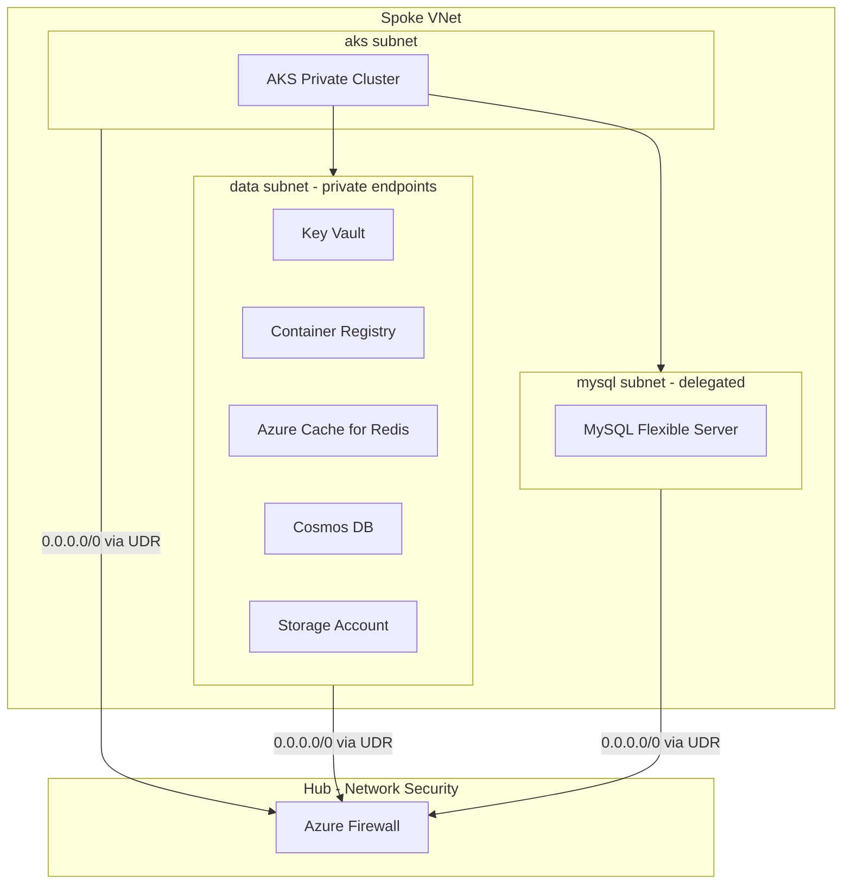

# Open edX Platform Infrastructure (Azure / Terraform)

Production-ready, modular Terraform for a secure Azure landing zone that hosts Open edX on AKS: private
networking, hub-and-spoke egress through Azure Firewall, AKS, ACR, MySQL Flexible Server, Cosmos DB
(Mongo API), Redis, Key Vault, storage, and managed identities.

## Architecture



All data services (Key Vault, ACR, Redis, Cosmos DB, Storage) are reachable **only** via private
endpoints on the `data` subnet; MySQL is VNet-injected directly into a delegated subnet. No database,
cache, registry, or vault has a public network endpoint.

## Repository layout

```
├── main.tf, network.tf, security.tf, compute.tf, data.tf, dns.tf   # root composition
├── variables.tf, locals.tf, outputs.tf, providers.tf, versions.tf
├── modules/
│   ├── network/      # VNet + subnets
│   ├── nsg/           # Reusable least-privilege NSG
│   ├── route-table/   # Forced-tunneling UDRs to Azure Firewall
│   ├── firewall/       # Azure Firewall + policy (network/application rules)
│   ├── identity/       # User-assigned managed identities + role assignments
│   ├── keyvault/       # Key Vault (RBAC, private endpoint, secrets, CMK + Disk Encryption Set)
│   ├── acr/            # Azure Container Registry (private, AcrPull via MI)
│   ├── aks/            # Private AKS cluster (AAD RBAC, workload identity, CSI secrets)
│   ├── mysql/          # Azure Database for MySQL Flexible Server (VNet-injected, HA, CMK)
│   ├── cosmosdb/       # Cosmos DB Mongo API (private endpoint, zone redundant, CMK)
│   ├── redis/          # Azure Cache for Redis (private endpoint, TLS 1.2+)
│   ├── storage/        # Storage account (private endpoint, versioned, encrypted, CMK)
│   ├── managed-disk/   # Standalone managed disks (opt-in, CMK-encrypted)
│   ├── defender/       # Optional Microsoft Defender for Cloud plan enrollment
│   └── monitoring/     # Log Analytics workspace, diagnostics, alerting
├── envs/
│   ├── dev/{terraform.tfvars, backend.hcl}
│   ├── uat/{terraform.tfvars, backend.hcl}
│   └── prod/{terraform.tfvars, backend.hcl}
├── bootstrap/          # One-time: creates the remote state storage account
└── docs/                # Architecture, security and deployment documentation
```

## Prerequisites

- Terraform >= 1.7
- Azure CLI, authenticated (`az login`) with rights to create resource groups, networking, AKS, and RBAC
  role assignments at the subscription/resource-group scope

## 1. Bootstrap remote state (run once per environment)

Each environment gets its own dedicated state resource group + storage account, isolated via a
Terraform workspace so one `bootstrap` config/state file can safely manage all three without
resource name collisions:

```bash
cd bootstrap
terraform init

terraform workspace new dev   # or: terraform workspace select dev
terraform apply -var-file=dev.tfvars

terraform workspace new uat
terraform apply -var-file=uat.tfvars

terraform workspace new prod
terraform apply -var-file=prod.tfvars
```

Each `<env>.tfvars` creates a dedicated resource group + storage account (versioned, TLS 1.2+,
shared-key access disabled, RBAC-only) matching the values already referenced by
`envs/<env>/backend.hcl`. Update `allowed_ip_ranges` in each tfvars file before applying.

## 2. Deploy an environment

```bash
terraform init -backend-config=envs/dev/backend.hcl
terraform plan  -var-file=envs/dev/terraform.tfvars
terraform apply -var-file=envs/dev/terraform.tfvars
```

Repeat with `envs/uat` / `envs/prod` and their own backend/tfvars files. Each environment is fully
isolated (own resource group, VNet, and state file).

## CI/CD (GitHub Actions)

[.github/workflows/terraform.yml](.github/workflows/terraform.yml) is manually triggered
(`workflow_dispatch`) with an `environment` choice input (`dev`/`uat`/`prod`) and runs two jobs:

1. **plan** — `terraform init` (using that environment's `backend.hcl`), `fmt -check`, `validate`,
   then `terraform plan`, uploaded as a build artifact.
2. **apply** — downloads the plan artifact and runs `terraform apply` against it, but only after
   the job's GitHub Environment approval gate is satisfied.

To enforce senior review before any `apply`, create GitHub **Environments** named `dev`, `uat`,
and `prod` (Settings → Environments) and add **required reviewers** to `uat`/`prod` (and `dev` too,
if desired). The `apply` job targets `environment: ${{ inputs.environment }}`, so GitHub blocks it
until an approver from that environment's reviewer list approves the run.

Configure these repository secrets for OIDC (password-less) authentication to Azure — no client
secret is stored:
- `AZURE_CLIENT_ID` — App registration/federated identity client ID
- `AZURE_TENANT_ID`
- `AZURE_SUBSCRIPTION_ID`

The federated credential's subject must match this repo/workflow (e.g.
`repo:<org>/<repo>:environment:dev`, `:uat`, `:prod` — one federated credential per environment).

## Development

```bash
terraform fmt -recursive
terraform init -backend=false
terraform validate
```

## Documentation

- [docs/ARCHITECTURE.md](docs/ARCHITECTURE.md) — component design and data flow
- [docs/SECURITY.md](docs/SECURITY.md) — security controls and best practices implemented
- [docs/DEPLOYMENT.md](docs/DEPLOYMENT.md) — step-by-step deployment and validation guide

## Contributing

Please keep changes focused, document new inputs and outputs, and include or update examples when
module behavior changes.
